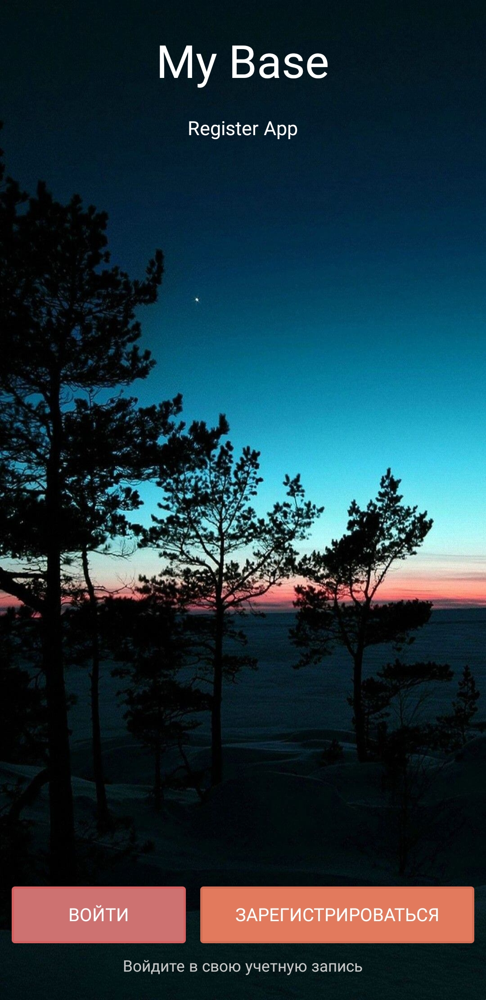
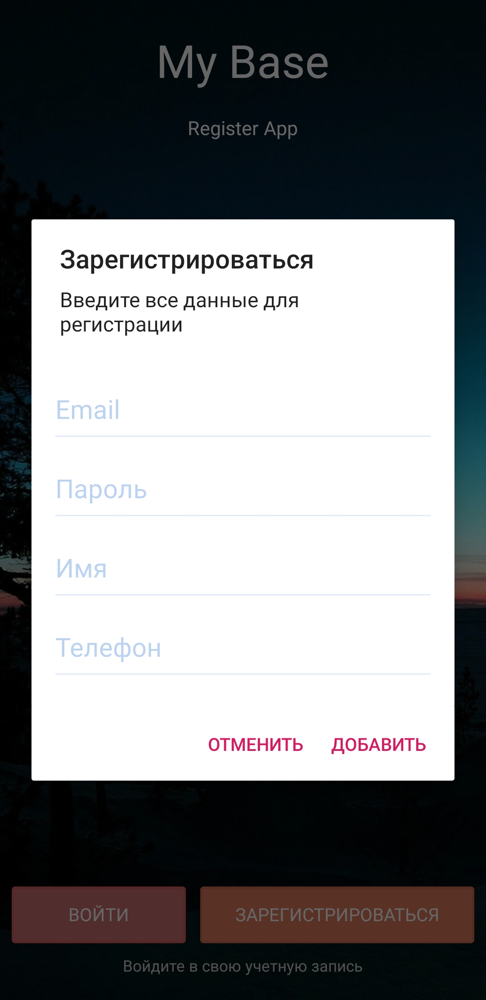
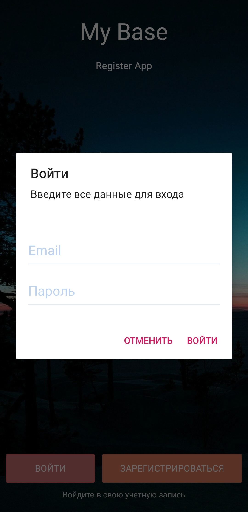

# Sign-Up-screen
**This app made during this [video course](https://itproger.com/course/android-firebase)**
=====
**I used [https://firebase.google.com/docs](FireBase DataBase) for this App
There are two buttons: for SignUp and SignIn

You can signUp in app by button "Зарегистрироваться"

After registration you will be added to dataBase and now you may signIn by button "Войти"

